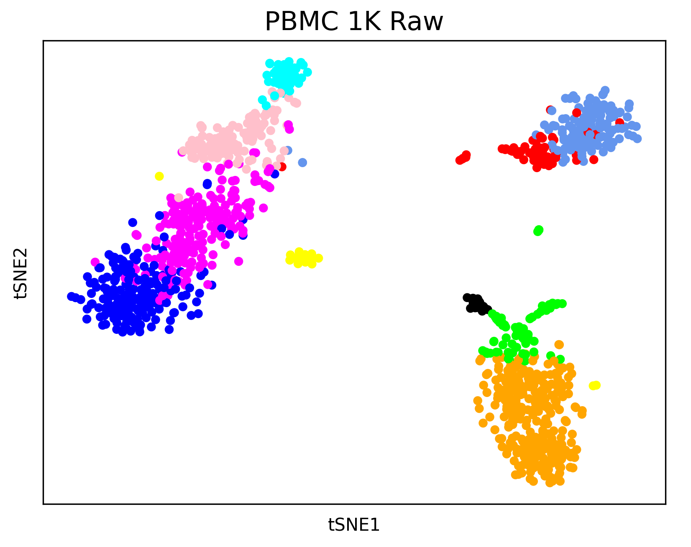
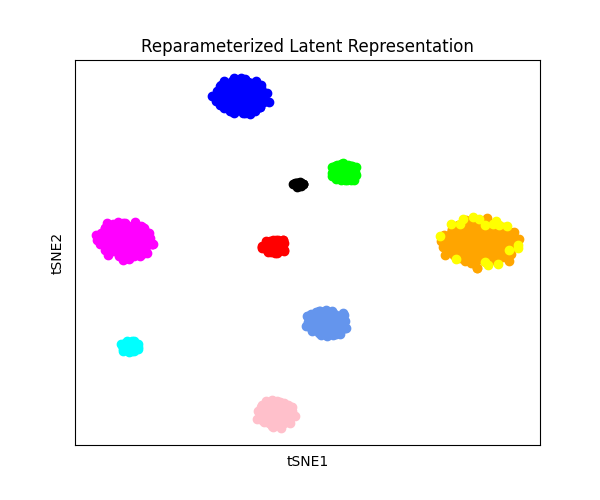

# bulk2sc
bulk2sc is the first framework that provides a solid foundation for generating single-cell data from bulk RNA-seq datasets. bulk2sc consists of three components: scGMVAE, Bulk Encoder, and genVAE, and they are visualized in the following figure:


<div align="center">
    
</div>

In its first component, scGMVAE, bulk2sc uses the low-dimensional representation of the single-cell gene expression data that [autoCell (Xu, 2022)](https://pubmed.ncbi.nlm.nih.gov/36814845/) creates using a Gaussian Mixture Model to learn cell type-specific distribution parameters $\mu_k$ and $\sigma_k^2$.


Below, we show four t-SNE plots that demonstrate the cell type clusters are different stages of bulk2sc: raw input data, reparameterized latent representation from GMM parameters $\mu_k$ and $\sigma_k^2$, reconstructed input data, and generated data.
<div align="center">
<table>
  <tr>
    <td>
      
    </td>
    <td>
      
    </td>
  </tr>
  <tr>
    <td>
      
    </td>
    <td>
      
    </td>
  </tr>
</table>
</div>

## quick start
For a quick start, you can download the PBMC 1K data and pre-trained Bulk Encoder and scDecoder weights [here](https://drive.google.com/drive/folders/1k_jK3tqNvHMoRXBtNtQ8rMrc12fiXkIi?usp=sharing). To run pre-trained model, simply place the unzipped files inside bulk2sc directory and run
```bash
cd bulk2sc
python bulk2sc.py
```

## custom data
To train with custom data, you will first need to:
1. run ```scType.R``` to generate cell types. You will need to modify the script for your specific data and filenames.
2. generate $\mu_k$ and $\sigma_k^2$ by following instructions the [autoCell repository.](https://github.com/ChengF-Lab/autoCell) The code is quite dense, however, and for a quick run you can find our [augmented autoCell code](https://github.com/berkuva/autoCell).

   a. Modify ```zeisel_exp.sh``` for an appropriate **dataset_name** and a desired set of hyperparameters.

   b. Modify line 295 to the correct number of **cell types**. This can either be the output from running ```scType.R``` or from prior knowledge.  Modify line 632 in ```models/model.py``` so $\mu_k$ and $\sigma_k^2$ are saved into desired **output_dir**.

   c. Modify ```eval_tools/dataset.py``` \_\_init\_\_ function so that **self.data** contains the correct keys **"x", "label", "count"**.

After obtaining $\mu_k$ and $\sigma_k^2$, we recommend following these steps:

1.
    ```bash
    python train_decoder.py
    ```
    ↳ Make sure that **scDecoder_model.pt** is saved upon completion.

2.
    ```bash
    python train_encoder.py
    ```
    ↳ Make sure that the loss associated with  $\mu_k$, $\sigma_k^2$, $\pi_k$ are close to 0. You might need to adjust the training process after observing the loss trajectory. Make sure that **bulkEncoder_model.pt** is saved upon completion.

    
3.
    ```bash
    python bulk2sc.py
    ```
    ↳ Make sure that **bulkEncoder_model.pt** and **scDecoder_model.pt** are correctly loaded and initialized. Each **batch_size** data generates one cell. 
    
