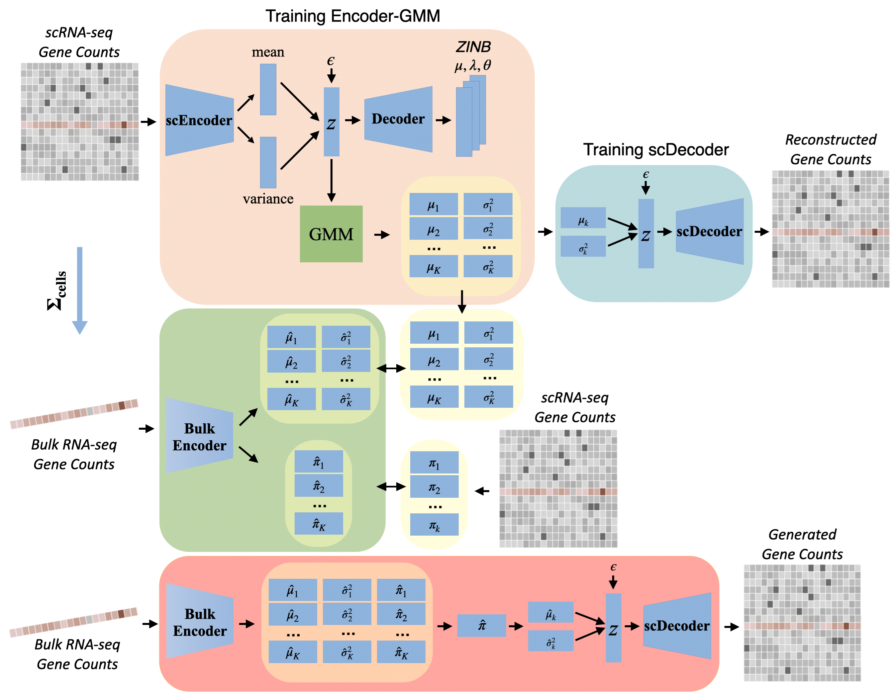
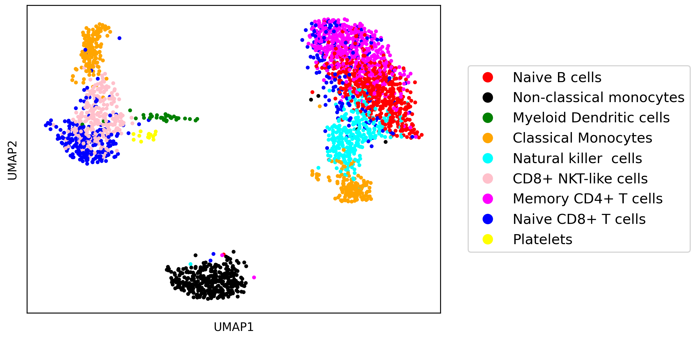
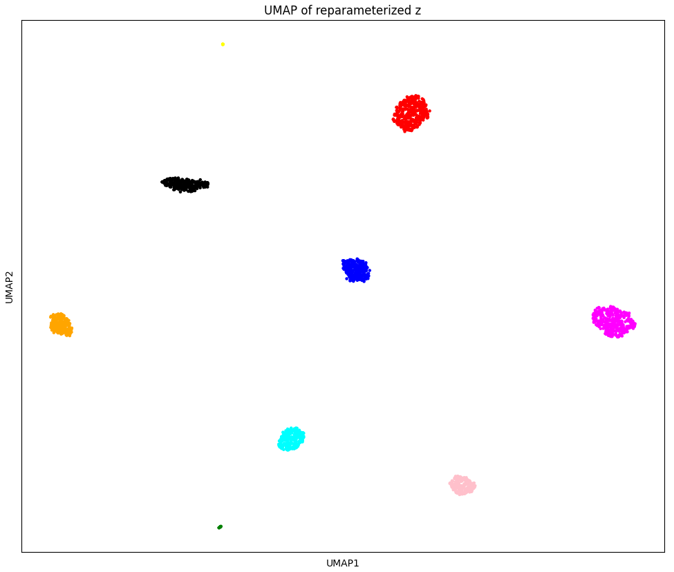
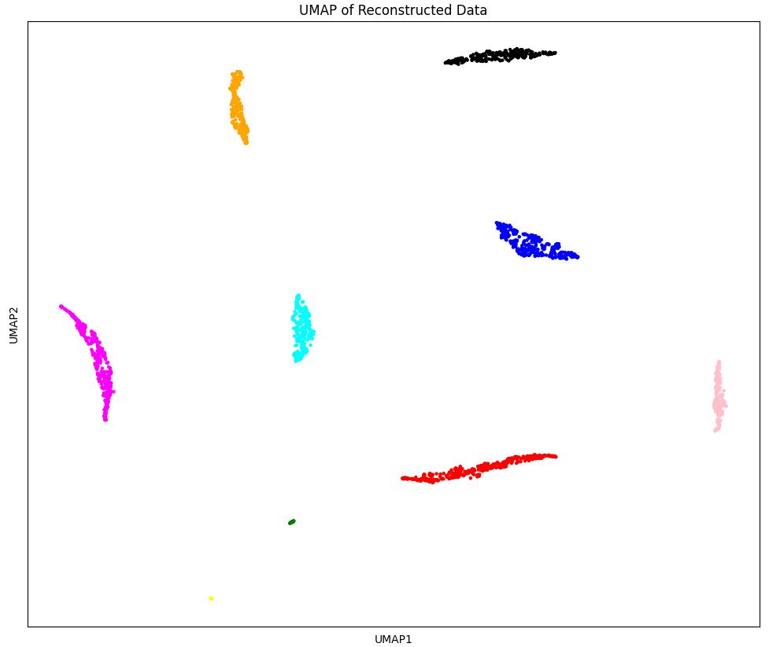
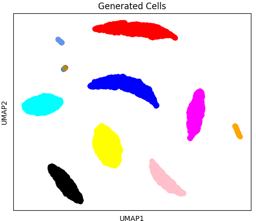

# bulk2sc
bulk2sc is the first framework that provides a solid foundation for generating single-cell data from bulk RNA-seq datasets that learns cell type distributions from single cell reference data. bulk2sc consists of three components: scGMVAE, Bulk Encoder, and genVAE, and they are visualized in the following figure:


<div align="center">
    
</div>


Below, we show four UMAPs that demonstrate the cell type clusters are different stages of bulk2sc: raw input data, reparameterized latent representation from GMM parameters $\mu_k$ and $\sigma_k^2$, reconstructed input data, and generated data.
<div align="center">
<table>
  <tr>
    <td>
      
    </td>
    <td>
      
    </td>
  </tr>
  <tr>
    <td>
      
    </td>
    <td>
      
    </td>
  </tr>
</table>
</div>

## quick start
For a quick start, you can download the PBMC 3K data from the 10X Genomics [website](https://www.10xgenomics.com/datasets/3-k-pbm-cs-from-a-healthy-donor-1-standard-1-1-0) and pre-trained Bulk Encoder and scDecoder weights in [Google Drive here](https://drive.google.com/drive/folders/1L3rrQoUbPZH4HqP5Z9w-MRHfuSGNl33S?usp=sharing). To run pre-trained model, simply place the unzipped files inside bulk2sc directory and run
```bash
cd bulk2sc
python main.py
```

## custom data
To train with custom data, you will first need to:
0. If cell types are necessary, run ```scType.R``` to them. You will need to modify the script for your specific data and filenames.
1. Modify parameters in utils.py.
2. Modify main.py to adjust filepath.
3. Run ```python main.py```
    
